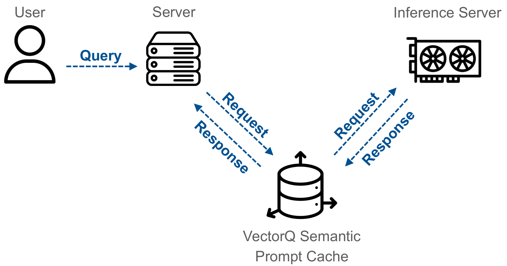
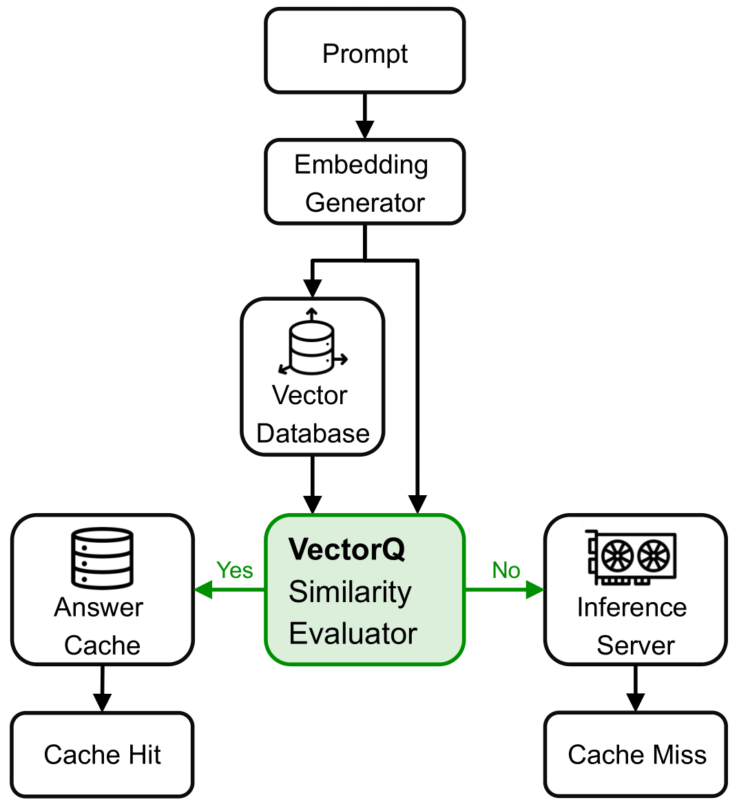

<br>
<p align="center">
  <picture>
    <source media="(prefers-color-scheme: dark)" srcset="./docs/vCache_Logo_For_Dark_Background.png">
    <source media="(prefers-color-scheme: light)" srcset="./docs/vCache_Logo_For_Light_Background.png">
    <!-- Fallback -->
    
  </picture>
</p>


<h3 align="center">
Reliable and Efficient Semantic Prompt Caching
</h3>
<br>


**vCache** is an adaptive semantic caching framework for large language models (LLMs) that reduces inference cost and latency by reusing responses for semantically similar prompts. Unlike traditional caches, vCache learns embedding-specific similarity thresholds to ensure response correctness and avoid unnecessary LLM calls. It integrates with vector databases and popular LLMs out of the box.

## Quick Install

First, install the vCache package.
```bash
pip install -e .
```

Second, set the OpenAI key. By default, vCache uses OpenAI for LLM inference and embedding generation, but you can configure any inference setting you like. 
```bash
export OPENAI_API_KEY="your_api_key_here"
```

Third, use vCache for your LLM inference.
```python
from vcache.main import vCache

vcache: vCache = vCache()
response, cache_hit = vcache.create("Is the sky blue?")

print(f"Response: {response}")
```

## Development Setup

To set up vCache for development:

### Using Poetry

1. Install Poetry if you don't have it already:
```bash
curl -sSL https://install.python-poetry.org | python3 -
```

2. Install dependencies:
```bash
poetry install --with dev,benchmarks
```

### Setting Up Pre-commit Hooks

Install pre-commit hooks to ensure code quality:
```bash
poetry run pre-commit install
```

The pre-commit hooks will automatically:
- Format code with Ruff
- Check imports
- Validate Python syntax
- Run type checking with mypy

When you commit changes, these checks will run automatically. You can also run them manually:
```bash
poetry run pre-commit run --all-files
```

## Semantic Prompt Caches
Semantic Prompt Caches are layered between your application server and inference server to reduce latency and cost by reusing cached responses for semantically similar prompts.



Unlike traditional caches, which only reuse responses for exact matches, semantic prompt caches generalize to prompts with similar meaning. For example:

For example:
- Prompt 1: Where was Roger Federer born?
- Prompt 2: In which town did Roger Federer grow up?

Both expect the same answer (Basel, Switzerland), but a traditional cache would miss this match. Semantic caches embed prompts as vectors, enabling similarity-based retrieval beyond exact string comparisons.



vCache improves semantic caching by learning embedding-specific similarity thresholds. This ensures cached responses are reused only when likely to be correct, avoiding incorrect hits and improving reliability over time.

## Benchmarking vCache

vCache includes a benchmarking framework to evaluate performance metrics such as cache hit rates, error rates, and latency improvements. For detailed instructions on running benchmarks, see the [Benchmarking Documentation](benchmarks/README.md).

## Citation

If you use vCache for your research, please cite our [paper](https://arxiv.org/abs/2502.03771).

```bibtex
@article{schroeder2025adaptive,
  title={Adaptive Semantic Prompt Caching with VectorQ},
  author={Schroeder, Luis Gaspar and Liu, Shu and Cuadron, Alejandro and Zhao, Mark and Krusche, Stephan and Kemper, Alfons and Zaharia, Matei and Gonzalez, Joseph E},
  journal={arXiv preprint arXiv:2502.03771},
  year={2025}
}
```
