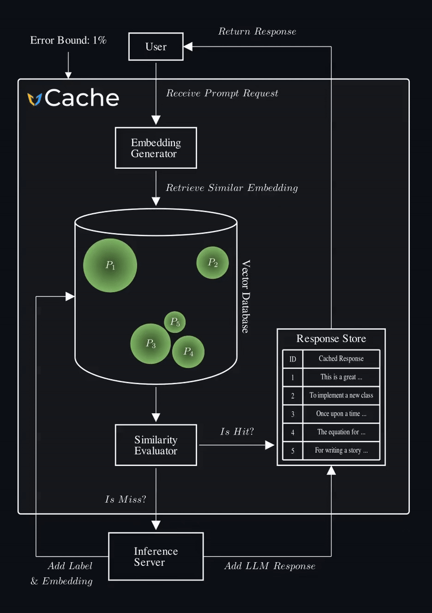

<br>
<p align="center">
  <picture>
    <source media="(prefers-color-scheme: dark)" srcset="./docs/vCache_Logo_For_Dark_Background.png">
    <source media="(prefers-color-scheme: light)" srcset="./docs/vCache_Logo_For_Light_Background.png">
    <!-- Fallback -->
    
  </picture>
</p>


<h3 align="center">
Reliable and Efficient Semantic Prompt Caching
</h3>
<br>


<p align="center">
  
  
  
</p>


vCache is the first semantic prompt cache that guarantees user-defined error rate bounds. Semantic caching reduces LLM latency and cost by returning cached model responses for semantically similar prompts (not just exact matches). vCache replaces static thresholds with **online-learned, embedding-specific decision boundaries**—no manual fine-tuning required. This enables reliable cached response reuse across any embedding model or workload.

> 💳
> **Cost & Latency Optimization** <br> 
> Reduce LLM API Costs by up to 10x. Decrease latency by up to 100x.

> 💡
> **Verified Semantic Prompt Caching** <br> 
> Set an error rate bound—vCache enforces it while maximizing cache hits.

> 🏢
> **System Agnostic Infrastructure** <br> 
> vCache uses OpenAI by default for both LLM inference and embedding generation, but you can configure any other inference setup.


## 🚀 Quick Install

Install vCache in editable mode:

```bash
pip install -e .
```

Then, set your OpenAI key:

```bash
export OPENAI_API_KEY="your_api_key_here"
```

Finally, use vCache in your Python code:

```python
from vcache import VCache, VCachePolicy, VerifiedDecisionPolicy

error_rate_bound: int = 0.01
policy: VCachePolicy = VerifiedDecisionPolicy(delta=error_rate_bound)
vcache: VCache = VCache(policy=policy)

response: str = vcache.infer("Is the sky blue?")
print(response)
```


## 🎬 How vCache Works

vCache intelligently detects when a new prompt is semantically equivalent to a cached one, and adapts its decision boundaries based on your accuracy requirements.
This lets it return cached model responses for semantically similar prompts—not just exact matches—reducing both inference latency and cost without sacrificing correctness.

<p align="left">
  
</p>

Please refer to the [vCache paper](https://arxiv.org/abs/2502.03771) for further details.


### System Integration

Semantic caches sit between the application server and the LLM inference backend.

<p align="left">
  <picture>
    <source media="(prefers-color-scheme: dark)" srcset="./docs/vCache_architecture.png">
    <source media="(prefers-color-scheme: light)" srcset="./docs/vCache_architecture_white.png">
    <!-- Fallback -->
    
  </picture>
</p>

Applications can range from agentic systems and RAG pipelines to database systems issuing LLM-based SQL queries. The inference backend can be a closed-source API (e.g., OpenAI, Anthropic) or a proprietary model hosted on-prem or in the cloud (e.g., LLaMA on AWS).


## ⚙️ Advanced Configuration

> [NOTE]
> vCache is currently in active development. Features and APIs may change as we continue to improve the system.

vCache is modular and highly configurable. Below is an example showing how to customize key components:


```python
from vcache import (
    HNSWLibVectorDB,
    InMemoryEmbeddingMetadataStorage,
    LLMComparisonSimilarityEvaluator,
    OpenAIEmbeddingEngine,
    OpenAIInferenceEngine,
    VCache,
    VCacheConfig,
    VCachePolicy,
    VerifiedDecisionPolicy,
    MRUEvictionPolicy,
)

# 1. Configure the components for vCache
config: VCacheConfig = VCacheConfig(
    inference_engine=OpenAIInferenceEngine(model_name="gpt-4.1-2025-04-14"),
    embedding_engine=OpenAIEmbeddingEngine(model_name="text-embedding-3-small"),
    vector_db=HNSWLibVectorDB(),
    embedding_metadata_storage=InMemoryEmbeddingMetadataStorage(),
    similarity_evaluator=LLMComparisonSimilarityEvaluator(
        inference_engine=OpenAIInferenceEngine(model_name="gpt-4.1-nano-2025-04-14")
    ),
    eviction_policy=MRUEvictionPolicy(max_size=4096),
)

# 2. Choose a caching policy
policy: VCachePolicy = VerifiedDecisionPolicy(delta=0.03)

# 3. Initialize vCache with the configuration and policy
vcache: VCache = VCache(config, policy)

response: str = vcache.infer("Is the sky blue?")
```

You can swap out any component—such as the eviction policy or vector database—for your specific use case.

By default, vCache uses:
- `OpenAIInferenceEngine`
- `OpenAIEmbeddingEngine`
- `HNSWLibVectorDB`
- `InMemoryEmbeddingMetadataStorage`
- `NoEvictionPolicy`
- `StringComparisonSimilarityEvaluator`
- `VerifiedDecisionPolicy` with a maximum failure rate of 2%

You can find complete working examples in the [`playground`](playground/) directory:

- [`example_1.py`](playground/example_1.py) - Basic usage with sample data processing
- [`example_2.py`](playground/example_2.py) - Advanced usage with cache hit tracking and timing


### Eviction Policy
vCache supports FIFO, LRU, MRU, and a custom SCU eviction policy. See the [Eviction Policy Documentation](vcache/vcache_core/cache/eviction_policy/README.md) for further details.


## 🛠 Developer Guide

For development setup and contribution guidelines, see [CONTRIBUTING.md](CONTRIBUTING.md).


## 📊 Benchmarking vCache

vCache includes a benchmarking framework to evaluate:
- **Cache hit rate**
- **Error rate**
- **Latency improvement**
- **...**

We provide three open benchmarks:
- **SemCacheLmArena** (chat-style prompts) - [Dataset  ↗](https://huggingface.co/datasets/vCache/SemBenchmarkLmArena)
- **SemCacheClassification** (classification queries) - [Dataset  ↗](https://huggingface.co/datasets/vCache/SemBenchmarkClassification)
- **SemCacheSearchQueries** (real-world search logs) - [Dataset  ↗](https://huggingface.co/datasets/vCache/SemBenchmarkSearchQueries)

See the [Benchmarking Documentation](benchmarks/ReadMe.md) for instructions.

## 📄 Citation

If you use vCache for your research, please cite our [paper](https://arxiv.org/abs/2502.03771).

```bibtex
@article{schroeder2025adaptive,
  title={vCache: Verified Semantic Prompt Caching},
  author={Schroeder, Luis Gaspar and Desai, Aditya and Cuadron, Alejandro and Chu, Kyle and Liu, Shu and Zhao, Mark and Krusche, Stephan and Kemper, Alfons and Zaharia, Matei and Gonzalez, Joseph E},
  journal={arXiv preprint arXiv:2502.03771},
  year={2025}
}
```
