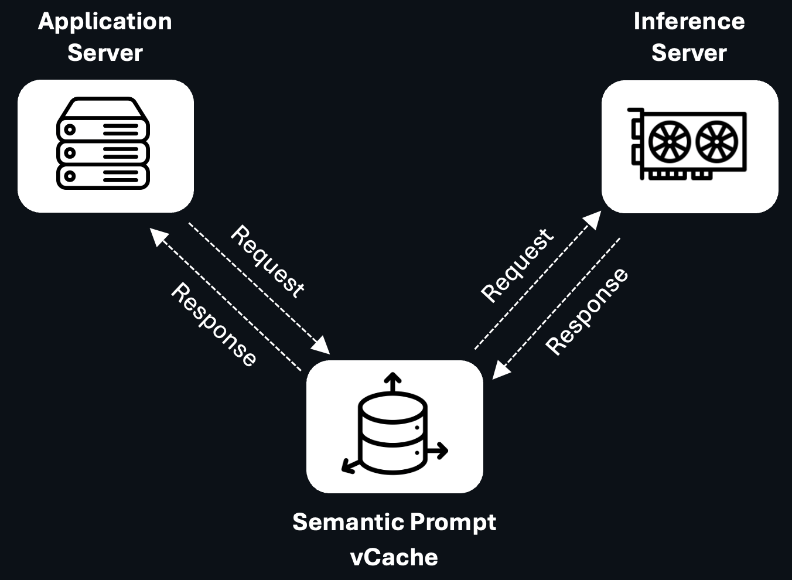
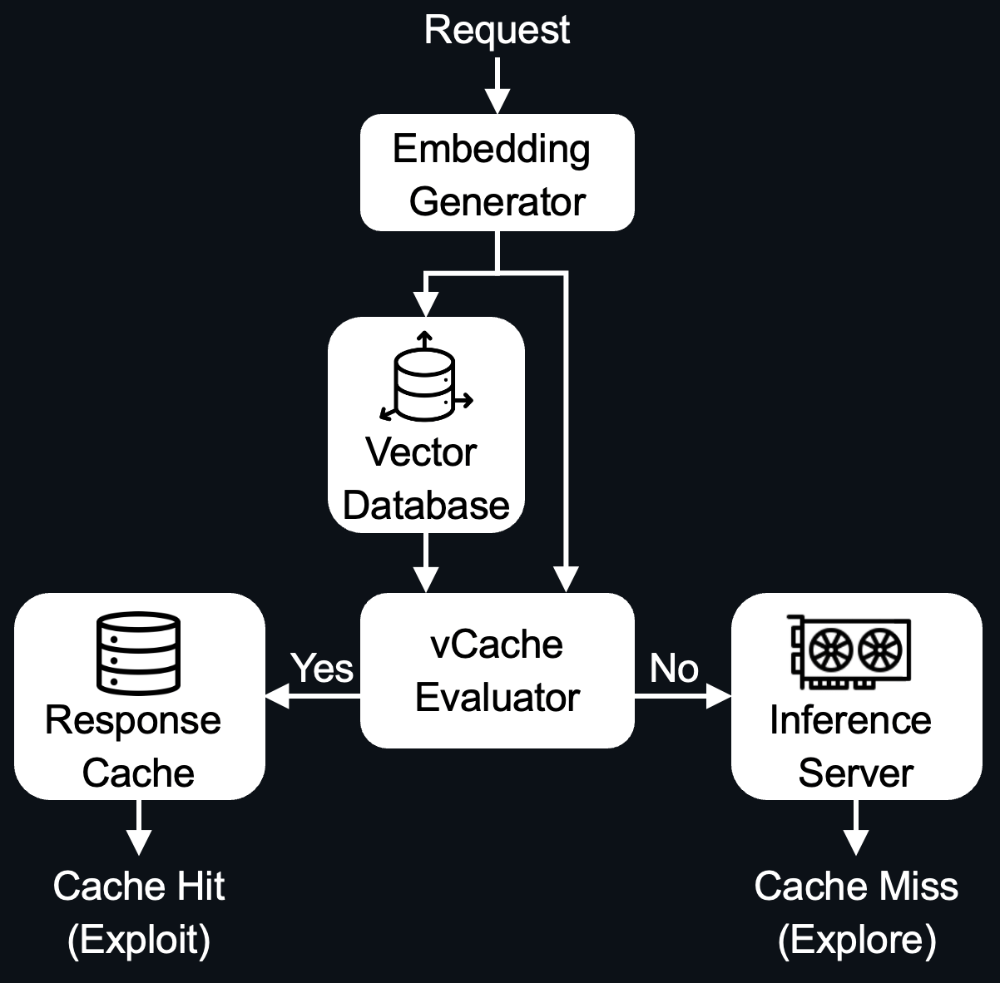

<br>
<p align="center">
  <picture>
    <source media="(prefers-color-scheme: dark)" srcset="./docs/vCache_Logo_For_Dark_Background.png">
    <source media="(prefers-color-scheme: light)" srcset="./docs/vCache_Logo_For_Light_Background.png">
    <!-- Fallback -->
    
  </picture>
</p>


<h3 align="center">
Reliable and Efficient Semantic Prompt Caching
</h3>
<br>


**vCache** is the first *verified* semantic cache for large language models (LLMs) with **user-defined failure rate guarantees**. Unlike existing systems that use a fixed global similarity threshold, vCache dynamically learns an optimal **per-embedding threshold** online, without any additional training. This approach enables **reliable reuse** of cached responses and **low latency inference**, even under tight error-rate constraints.


## 🚀 Quick Install

Install vCache in editable mode:

```bash
pip install -e .
```

Then, set your OpenAI key:

```bash
export OPENAI_API_KEY="your_api_key_here"
```
(Note: vCache uses OpenAI by default for both LLM inference and embedding generation, but you can configure any other backend)

Finally, use vCache in your Python code:

```python
from vcache.main import VCache

vcache = VCache()
response, cache_hit = vcache.create("Is the sky blue?")
print(f"Response: {response}")
```

By default, vCache uses:
- `OpenAIInferenceEngine`
- `OpenAIEmbeddingEngine`
- `HNSWLibVectorDB`
- `InMemoryEmbeddingMetadataStorage`
- `NoEvictionPolicy`
- `StringComparisonSimilarityEvaluator`
- `DynamicLocalThresholdPolicy` with a maximum failure rate of 2%


## ⚙️ Advanced Configuration

vCache is modular and highly configurable. Below is an example showing how to customize key components:

<details closed>
<summary>Imports</summary>

```python
from vcache.main import VCache
from vcache.config import VCacheConfig
from vcache.inference_engine.strategies.open_ai import OpenAIInferenceEngine
from vcache.vcache_core.cache.embedding_engine.strategies.open_ai import OpenAIEmbeddingEngine
from vcache.vcache_core.cache.embedding_store.embedding_metadata_storage.strategies.in_memory import InMemoryEmbeddingMetadataStorage
from vcache.vcache_core.similarity_evaluator.strategies.string_comparison import StringComparisonSimilarityEvaluator
from vcache.vcache_policy.strategies.dynamic_local_threshold import DynamicLocalThresholdPolicy
from vcache.vcache_policy.vcache_policy import VCachePolicy
from vcache.vcache_core.cache.embedding_store.vector_db import HNSWLibVectorDB, SimilarityMetricType
```
</details>

```python
vcache_policy: VCachePolicy = DynamicLocalThresholdPolicy(delta=0.02)
vcache_config: VCacheConfig = VCacheConfig(
    inference_engine=OpenAIInferenceEngine(),
    embedding_engine=OpenAIEmbeddingEngine(),
    vector_db=HNSWLibVectorDB(
        similarity_metric_type=SimilarityMetricType.COSINE,
        max_capacity=100_000,
    ),
    embedding_metadata_storage=InMemoryEmbeddingMetadataStorage(),
    similarity_evaluator=StringComparisonSimilarityEvaluator,
)

vcache = VCache(vcache_config, vcache_policy)
```

You can swap out any component—such as the eviction policy or vector database—for your specific use case.


## 🧠 What Is Semantic Caching?

Semantic caching reduces LLM inference latency and cost by reusing previously generated responses for **semantically similar prompts** (not just exact matches). 

<p align="left">
  
</p>

### Architecture Overview


Here’s how it works:
- Prompts are embedded using a vector encoder and stored in a vector database.
- At query time, the most similar cached prompt is retrieved.
- A similarity score (e.g., cosine) is computed.
- If the score is sufficiently high, the cached response is reused.

<p align="left">
  
</p>

Traditional systems use a **global threshold** to make reuse decisions, but this fails to capture prompt-specific variation in correctness.

vCache instead learns a **separate decision boundary per embedding** and adapts it over time to guarantee a user-specified error rate.

<p align="left">
  
</p>


## 🛠 Developer Guide

For advanced usage and development setup, see the [Developer Guide](README_DEV.md).


## 📊 Benchmarking vCache

vCache includes a benchmarking framework to evaluate:
- **Cache hit rate**
- **Error rate**
- **Latency improvement**
- **...**

We provide three open benchmarks:
- **SemCacheLmArena** (chat-style prompts) - [Dataset](https://huggingface.co/datasets/vCache/SemBenchmarkLmArena)
- **SemCacheClassification** (classification queries) - [Dataset](https://huggingface.co/datasets/vCache/SemBenchmarkClassification)
- **SemCacheSearchQueries** (real-world search logs) - [Dataset](https://huggingface.co/datasets/vCache/SemBenchmarkSearchQueries)

See the [Benchmarking Documentation](benchmarks/README.md) for instructions.