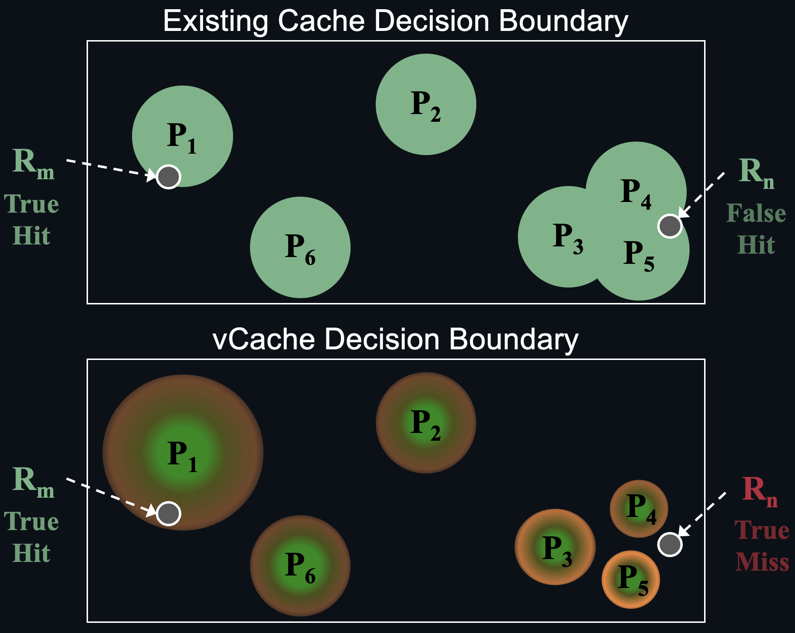

<br>
<p align="center">
  <picture>
    <source media="(prefers-color-scheme: dark)" srcset="./docs/vCache_Logo_For_Dark_Background.png">
    <source media="(prefers-color-scheme: light)" srcset="./docs/vCache_Logo_For_Light_Background.png">
    <!-- Fallback -->
    
  </picture>
</p>


<h3 align="center">
Reliable and Efficient Semantic Prompt Caching
</h3>
<br>


**vCache** is the first verified semantic cache for LLMs that **guarantees user-defined error rate bounds**. Semantic caching reduces LLM latency and cost by returning cached model responses for semantically similar prompts (not just exact matches). vCache replaces static thresholds with **online-learned, embedding-specific decision boundaries**—no manual fine-tuning required. This enables reliable cached response reuse across any embedding model or workload.


> [NOTE]
> vCache is currently in active development. Features and APIs may change as we continue to improve the system.


## 🚀 Quick Install

Install vCache in editable mode:

```bash
pip install -e .
```

Then, set your OpenAI key:

```bash
export OPENAI_API_KEY="your_api_key_here"
```
(Note: vCache uses OpenAI by default for both LLM inference and embedding generation, but you can configure any other backend)

Finally, use vCache in your Python code:

```python
from vcache.main import VCache

vcache = VCache()
response, cache_hit = vcache.create("Is the sky blue?")
print(f"Response: {response}")
```

By default, vCache uses:
- `OpenAIInferenceEngine`
- `OpenAIEmbeddingEngine`
- `HNSWLibVectorDB`
- `InMemoryEmbeddingMetadataStorage`
- `NoEvictionPolicy`
- `StringComparisonSimilarityEvaluator`
- `DynamicLocalThresholdPolicy` with a maximum failure rate of 2%


## ⚙️ Advanced Configuration

vCache is modular and highly configurable. Below is an example showing how to customize key components:

<details closed>
<summary>Imports</summary>

```python
from vcache.main import VCache
from vcache.config import VCacheConfig
from vcache.inference_engine.strategies.open_ai import OpenAIInferenceEngine
from vcache.vcache_core.cache.embedding_engine.strategies.open_ai import OpenAIEmbeddingEngine
from vcache.vcache_core.cache.embedding_store.embedding_metadata_storage.strategies.in_memory import InMemoryEmbeddingMetadataStorage
from vcache.vcache_core.similarity_evaluator.strategies.string_comparison import StringComparisonSimilarityEvaluator
from vcache.vcache_policy.strategies.dynamic_local_threshold import DynamicLocalThresholdPolicy
from vcache.vcache_policy.vcache_policy import VCachePolicy
from vcache.vcache_core.cache.embedding_store.vector_db import HNSWLibVectorDB, SimilarityMetricType
```
</details>

```python
vcache_policy: VCachePolicy = DynamicLocalThresholdPolicy(delta=0.02)
vcache_config: VCacheConfig = VCacheConfig(
    inference_engine=OpenAIInferenceEngine(),
    embedding_engine=OpenAIEmbeddingEngine(),
    vector_db=HNSWLibVectorDB(
        similarity_metric_type=SimilarityMetricType.COSINE,
        max_capacity=100_000,
    ),
    embedding_metadata_storage=InMemoryEmbeddingMetadataStorage(),
    similarity_evaluator=StringComparisonSimilarityEvaluator,
)

vcache = VCache(vcache_config, vcache_policy)
```

You can swap out any component—such as the eviction policy or vector database—for your specific use case.

## 🧠 What Is Semantic Caching?

Semantic caching reduces LLM latency and cost by returning cached model responses for **semantically similar** prompts (not just exact matches)—so you don’t pay for inference cost and latency on repeated questions that have the same answer.

<p align="left">
  
</p>

### Architecture Overview

1. **Embed & Store**  
Each prompt is converted to a fixed-length vector (an “embedding”) and stored in a vector database along with its LLM response.

2. **Nearest-Neighbor Lookup**  
When a new prompt arrives, the cache embeds it and finds its most similar stored prompt using a similarity metric (e.g., cosine similarity).

3. **Similarity Score**  
The system computes a score between 0 and 1 that quantifies how “close” the new prompt is to the retrieved entry.

4. **Decision: Exploit vs. Explore**  
   - **Exploit (cache hit):** If the similarity is above a confidence bound, return the cached response.  
   - **Explore (cache miss):** Otherwise, infer the LLM for a response, add its embedding and answer to the cache, and return it.

<p align="left">
  
</p>

### Why Fixed Thresholds Fall Short
Existing semantic caches rely on a **global static threshold** to decide whether to reuse a cached response (exploit) or invoke the LLM (explore). If the similarity score exceeds this threshold, the cache reuses the response; otherwise, it infers the model. This strategy is fundamentally limited.

- **Uniform threshold, diverse prompts:** A fixed threshold assumes all embeddings are equally distributed—ignoring that similarity is context-dependent.
- **Threshold too low → false positives:** Prompts with low semantic similarity may be incorrectly treated as equivalent, resulting in reused responses that do not match the intended output.
- **Threshold too high → false negatives:** Prompts with semantically equivalent meaning may fail the similarity check, forcing unnecessary LLM inference and reducing cache efficiency.
- **No correctness control:** There is no mechanism to ensure or even estimate how often reused answers will be wrong.

In short, fixed thresholds trade correctness for simplicity—and offer no guarantees. Please refer to the [vCache paper](https://arxiv.org/abs/2502.03771) for further details.

### Introducing vCache

vCache overcomes these limitations with two ideas:

- **Per-Prompt Decision Boundary**  
  vCache learns a custom decision boundary for each cached prompt, based on past observations of “how often similarity × actually matched the correct response.”

- **Built-In Error Constraint**  
  You specify a maximum error rate (e.g., 1%). vCache adjusts every per-prompt decision boundary online —no offline training or fine-tuning required.

### Benefits

- **Reliability**  
  Formally bounds the rate of incorrect cache hits to your chosen tolerance.  
- **Performance**  
  Matches or exceeds static-threshold systems in cache hit rate and end-to-end latency.  
- **Simplicity**  
  Plug in any embedding model; vCache learns and adapts automatically at runtime.

<p align="left">
  
</p>

Please refer to the [vCache paper](https://arxiv.org/abs/2502.03771) for further details.


## 🛠 Developer Guide

For advanced usage and development setup, see the [Developer Guide](ReadMe_Dev.md).


## 📊 Benchmarking vCache

vCache includes a benchmarking framework to evaluate:
- **Cache hit rate**
- **Error rate**
- **Latency improvement**
- **...**

We provide three open benchmarks:
- **SemCacheLmArena** (chat-style prompts) - [Dataset  ↗](https://huggingface.co/datasets/vCache/SemBenchmarkLmArena)
- **SemCacheClassification** (classification queries) - [Dataset  ↗](https://huggingface.co/datasets/vCache/SemBenchmarkClassification)
- **SemCacheSearchQueries** (real-world search logs) - [Dataset  ↗](https://huggingface.co/datasets/vCache/SemBenchmarkSearchQueries)

See the [Benchmarking Documentation](benchmarks/ReadMe.md) for instructions.

## 📄 Citation

If you use vCache for your research, please cite our [paper](https://arxiv.org/abs/2502.03771).

```bibtex
@article{schroeder2025adaptive,
  title={vCache: Verified Semantic Prompt Caching},
  author={Schroeder, Luis Gaspar and Liu, Shu and Cuadron, Alejandro and Zhao, Mark and Krusche, Stephan and Kemper, Alfons and Zaharia, Matei and Gonzalez, Joseph E},
  journal={arXiv preprint arXiv:2502.03771},
  year={2025}
}
```